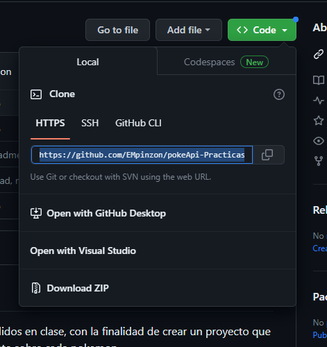
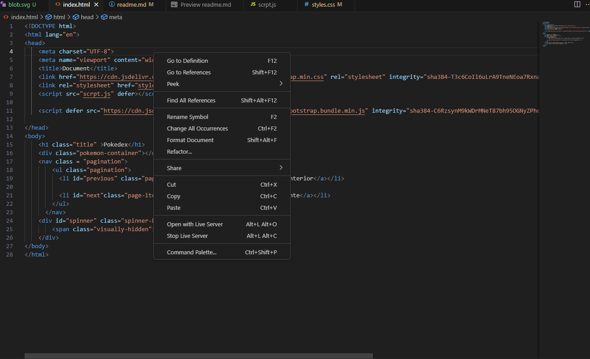
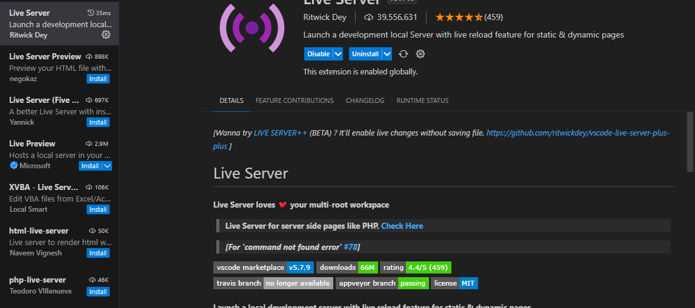
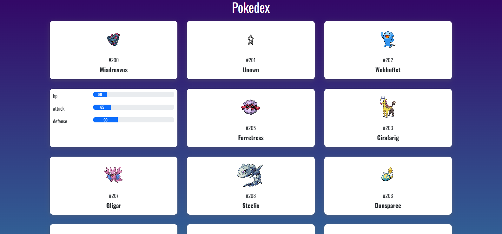
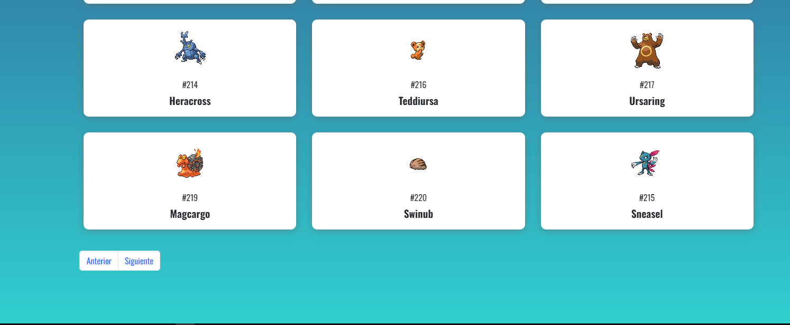

# Proyecto practica poke-api

Este es un proyecto en el cual se integra los conceptos aprendidos en clase, con la finalidad de crear un proyecto que consume la api de pokemon para mostrar informacion relevante sobre cada pokemon.

## Tencologia usadas: 

En este proyecto se creo una pagina web usando las siguientes tecnologias :
+ javascript
+ html
+ css
+ Pokeapi

## Conceptos de javascript usados

En esta pagina web usamos la api de pokemon para traer informacion sobre los pokemon y poder imprimir esa informacion. Los principales conceptos nuevos de js que se tomaron en cuenta son:

+ Api fetch para hacer solicitudes a la poke api
+ Manipulacion del dom 
+ Manejo de funciones asincronas
+ Conceptos basicos sobre las apis
+ Metodos y propiedades utiles de los elementos html dentro de javascript

## Como usar el proyecto 

Te muestro como ejecutar el proyecto en tu computadora:

+ Puedes clonar el repositorio con `git clone https://github.com/EMpinzon/pokeApi-Practicas.git` o puedes descargarlo como .zip

+ Agregas el  proyecto en tu pc
+ Abres la carpeta con el contendio
+ Vas a index.html
+ Si tienes live server, puedes dar click derecho, abrir con live server

+ Si no tienes live server, puedes ir a extensiones y dar click en instalar

## Funcionalidades 

Este proyecto te permite distintas funciones :

+ Informacion basica de el pokemon en una card

+ En la parte tracera de la card encontraras informacion de las estadisticas de el pokemon, puedes acceder solo dejando el cursos en la tarjeta

+ Cambiar de pagina hacia adelante o hacia atras, esto te mostrara 21 pokemons por pagina

## Contribuciones 

Puedes contribuir a este proyecto si deseas por medio de pull request para proponer un cambio, lo tendremos en cuenta y lo implementaremos si es necesario

## Autor 

[Edgar Mauricio Pinzon Monsalve](https://github.com/EMpinzon/pokeApi-Practicas.git)

